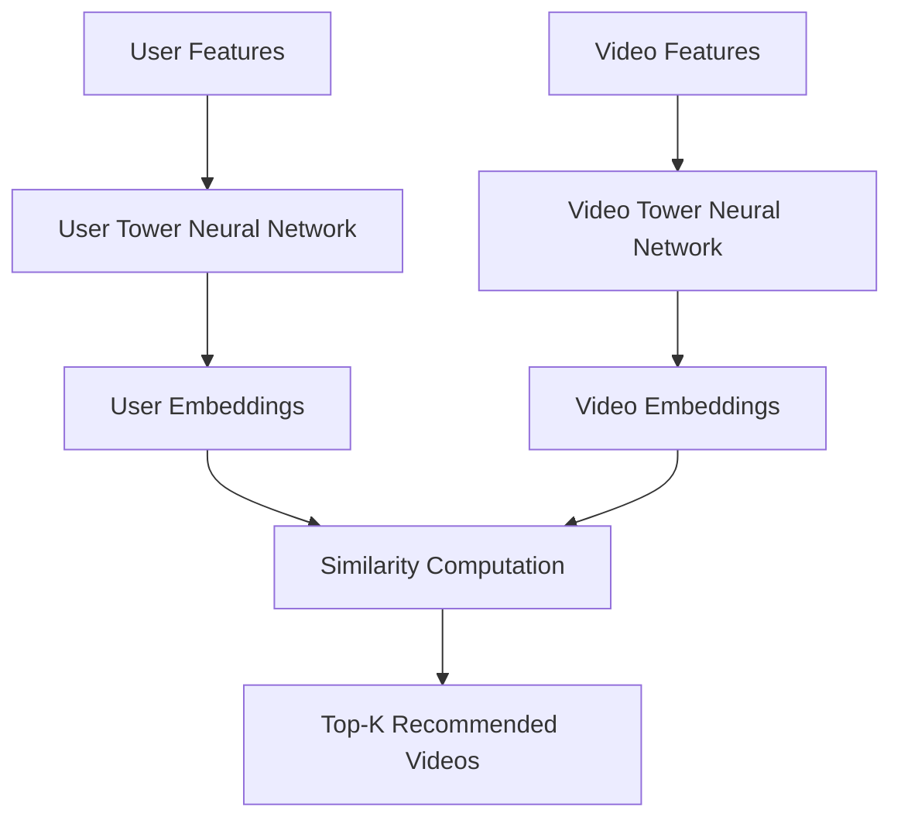
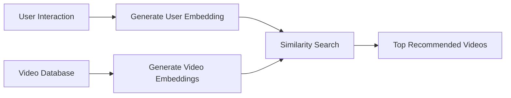

# Personalized Video Recommendation Engine using YouTube-Style Two-Tower Architecture

## Overview

This project implements a scalable and personalized video recommendation system inspired by YouTube’s recommendation architecture using a Two-Tower Deep Learning Model. The system learns user preferences and video characteristics separately and maps them into a shared embedding space to generate highly relevant video recommendations.

The recommendation engine is designed for large-scale candidate retrieval systems and demonstrates how modern recommendation platforms personalize content efficiently.

---

## Features

- Personalized video recommendations
- YouTube-style Two-Tower neural architecture
- User and video embedding generation
- Similarity-based recommendation retrieval
- Deep learning powered recommendation engine
- Scalable candidate generation system
- Embedding space learning
- Fast recommendation retrieval
- Easy to extend and deploy

---

## Project Architecture



---

## How the System Works

### Step 1: User Feature Processing

The user tower processes:
- User ID
- Watch history
- Search history
- Preferred categories
- Interaction behavior

It converts user information into dense vector embeddings.

---

### Step 2: Video Feature Processing

The video tower processes:
- Video ID
- Title
- Category
- Tags
- Description
- Creator information

It converts video information into vector embeddings.

---

### Step 3: Embedding Space Learning

The model learns a shared embedding space where:
- Similar users and videos are placed closer together
- Irrelevant videos are placed farther apart

---

### Step 4: Similarity Computation

The recommendation engine computes similarity using:
- Dot Product
- Cosine Similarity

Videos with the highest similarity scores are recommended to the user.

---

## Tech Stack

| Technology | Purpose |
|---|---|
| Python | Core programming language |
| TensorFlow / PyTorch | Deep learning framework |
| Pandas | Data preprocessing |
| NumPy | Numerical computations |
| Scikit-learn | Data utilities |
| FAISS / ANN | Fast similarity search |
| Streamlit / Flask | Deployment and UI |

---

## Machine Learning Concepts Used

- Deep Learning
- Recommendation Systems
- Two-Tower Architecture
- Embedding Learning
- Candidate Retrieval
- Similarity Search
- Approximate Nearest Neighbor (ANN)
- Neural Collaborative Filtering

---

## Dataset

The dataset contains:
- User interactions
- Video metadata
- Watch history
- Engagement information

Example dataset fields:

| Field | Description |
|---|---|
| User ID | Unique user identifier |
| Video ID | Unique video identifier |
| Watch Time | User watch duration |
| Category | Video category |
| Tags | Video tags |
| Rating | User interaction score |

---

## Model Architecture

### User Tower

The user tower learns user behavior patterns and generates user embeddings.

```python
user_model = Sequential([
    Embedding(...),
    Dense(...),
    Dense(...)
])
```

---

### Video Tower

The video tower learns video content characteristics and generates video embeddings.

```python
video_model = Sequential([
    Embedding(...),
    Dense(...),
    Dense(...)
])
```

---

### Embedding Similarity

```python
similarity = tf.reduce_sum(
    user_embedding * video_embedding
)
```

---

## Training Process

The model is trained using:
- Positive user-video interactions
- Negative sampling techniques

Objective:
- Maximize similarity for relevant videos
- Minimize similarity for irrelevant videos

Loss functions used:
- Contrastive Loss
- Retrieval Loss
- Cross Entropy Loss

---

## Installation

Clone the repository:

```bash
git clone https://github.com/your-username/Personalized-Video-Recommendation-Engine.git
```

Navigate to the project directory:

```bash
cd Personalized-Video-Recommendation-Engine
```

Install dependencies:

```bash
pip install -r requirements.txt
```

---

## Running the Project

Run the training pipeline:

```bash
python train.py
```

Run the recommendation system:

```bash
python app.py
```

If using Streamlit:

```bash
streamlit run app.py
```

---

## Recommendation Workflow



---

## Example Recommendation Output

| User | Recommended Videos |
|---|---|
| User A | AI Tutorials, Deep Learning Videos |
| User B | Music Videos, Podcasts |
| User C | Travel Vlogs, Adventure Content |

---

## Scalability Advantages

This architecture is highly scalable because:
- Video embeddings can be precomputed offline
- Fast retrieval using vector similarity search
- Efficient handling of millions of users and videos
- Suitable for real-time recommendation systems

---

## Evaluation Metrics

The recommendation system can be evaluated using:

- Precision@K
- Recall@K
- NDCG
- Hit Rate
- Mean Average Precision (MAP)

---

## Future Improvements

- Add Transformer-based encoders
- Use BERT embeddings for video titles
- Add thumbnail image embeddings
- Implement real-time recommendations
- Integrate vector databases like Pinecone
- Add ranking models
- Deploy using Docker and Kubernetes
- Add user session-based recommendations

---

## Applications

This recommendation system can be used for:
- Video streaming platforms
- E-learning platforms
- OTT applications
- Music recommendation systems
- Social media feeds
- Personalized content delivery systems

---

## Screenshots

### Home Page

Add project screenshots here.

```md

```

---

### Recommendation Output

```md

```

---

## Folder Structure

```bash
├── data/
├── models/
├── notebooks/
├── images/
├── app.py
├── train.py
├── requirements.txt
├── README.md
└── utils.py
```

---

## Why Two-Tower Models?

Two-Tower models are widely used in industry because they:
- Enable efficient candidate retrieval
- Support large-scale recommendation systems
- Learn meaningful embeddings
- Provide highly personalized recommendations
- Reduce inference latency

Platforms using similar architectures:
- YouTube
- Netflix
- Spotify
- LinkedIn
- Instagram

---

## Learning Outcomes

This project demonstrates:
- Recommendation system design
- Deep learning model building
- Embedding generation
- Similarity search
- Scalable AI system development
- Candidate retrieval pipelines

---

## Contributors

- Akula Dedeepya

---

## License

This project is licensed under the MIT License.

---

## Acknowledgements

Inspired by:
- YouTube Recommendation System
- TensorFlow Recommenders
- Deep Learning Retrieval Models
- Modern Recommendation System Architectures

---

